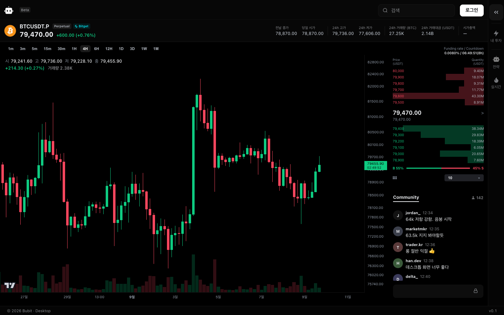
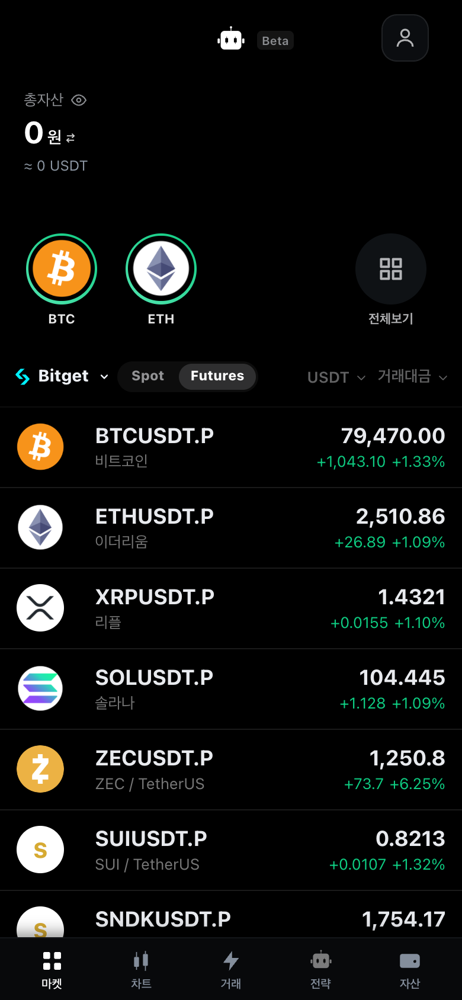
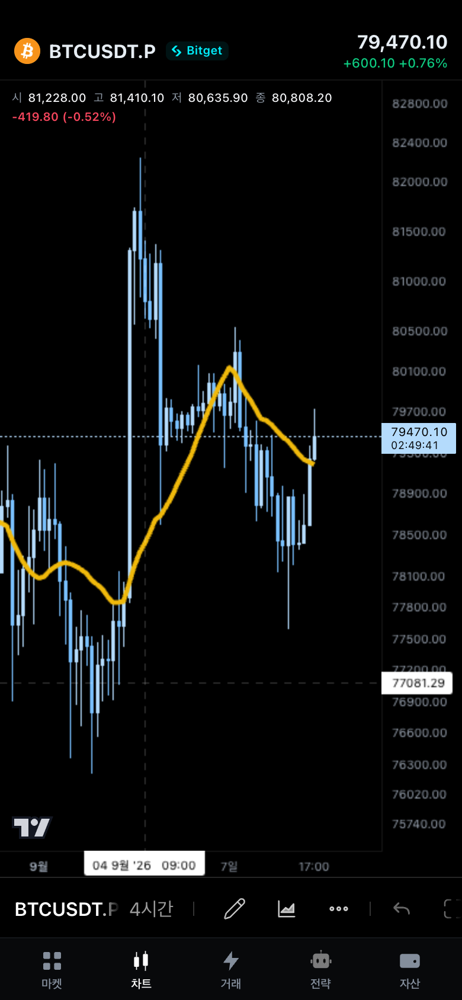

<p align="center">
  
</p>

<h1 align="center"></h1>

<p align="center">
  <strong>여러 거래소의 실시간 시세와 차트를 한곳에서.</strong><br />
  PC와 모바일을 위한 암호화폐 분석 앱
</p>

<p align="center">
  <a href="docs/SETUP.md">시작하기</a> ·
  <a href="docs/USER-GUIDE.md">사용 가이드</a> ·
  <a href="CHANGELOG.md">업데이트</a> ·
  <a href="SUPPORT.md">피드백</a>
</p>

<p align="center">
  <a href="https://github.com/Hdev-x/Bubit/actions/workflows/ci.yml"></a>
</p>

> **Beta 소스 공개 중** · 현재는 로컬에서 실행할 수 있으며, 외부 접속용 서비스 주소는 준비 중입니다.

## 화면 미리보기

**PC · 차트 분석**

<p align="center">
  
</p>

PC의 Community 메시지와 인원수는 UI 샘플이며, 실제 채팅은 아직 지원하지 않습니다.

<table>
  <tr>
    <th align="center">Mobile · 마켓</th>
    <th align="center">Mobile · 차트</th>
  </tr>
  <tr>
    <td align="center"></td>
    <td align="center"></td>
  </tr>
</table>

공개 시세 스냅샷을 연결한 로컬 UI 미리보기입니다(2026-09-09 촬영). 계좌는 미연결 상태이며, 이미지 속 가격은 현재 시세가 아닙니다.

## 주요 기능

| 기능 | 할 수 있는 일 |
| --- | --- |
| 실시간 마켓 | 거래소별 시세와 호가를 확인하고, 종목을 검색하거나 관심종목으로 관리합니다. |
| 차트 분석 | 시간봉을 전환하고 지표, SMC·하모닉·파동 분석과 드로잉 도구로 차트를 살펴봅니다. |
| PC·Mobile 화면 | PC에서는 차트·시세·호가 패널을 함께 보고, Mobile에서는 전용 탭과 시트로 마켓·차트·자산을 확인합니다. |
| 계좌 조회 | 선택적으로 Bitget 계좌를 연결해 자산·포지션·미체결 주문을 조회합니다. |

분석 도구의 기기별 이용 조건은 아래 [지원 범위](#지원-범위와-안내)를 확인하세요.

## 빠른 시작

Node.js 22, Java 21, PostgreSQL이 필요합니다. 저장소를 내려받은 뒤 [로컬 실행 가이드](docs/SETUP.md)에 따라 DB와 API를 설정하고 Web을 실행하세요.

```bash
git clone https://github.com/Hdev-x/Bubit.git
cd Bubit
```

로컬 실행을 마치면 다음 주소에서 사용할 수 있습니다.

- **PC:** [localhost:5174/web/](http://localhost:5174/web/) — 로그인 전에도 실시간 마켓을 살펴볼 수 있습니다.
- **Mobile:** [localhost:5173/mobile/](http://localhost:5173/mobile/) — PC 화면에서 가입한 계정으로 로그인해 사용합니다. PC 브라우저에서도 Mobile 화면을 열 수 있습니다.

마켓·차트 사용 순서와 계좌 연결 방법은 [사용 가이드](docs/USER-GUIDE.md)를 참고하세요.

## 지원 범위와 안내

| 항목 | 현재 Beta 지원 범위 |
| --- | --- |
| 시세·차트 | Binance · Bitget · Upbit · Bithumb. 거래소별 상품·종목 범위는 다릅니다. |
| 지표·분석 도구 | Mobile에서 사용 가능하며, PC 지표 기능은 관리자 계정으로 제한됩니다. |
| 계좌 연결 | Bitget 조회 전용입니다. 실제 주문·자동매매 기능은 제공하지 않습니다. |

거래소 응답과 네트워크 상태에 따라 시세 갱신이 지연될 수 있습니다. 미연결 메뉴와 데이터 삭제 등 현재 제한은 [사용 전 알아둘 점](docs/USER-GUIDE.md#알아둘-점)에 정리했습니다.

사용자에게 보이는 변경은 [변경 이력](CHANGELOG.md)에 계속 쌓습니다. 아직 버전 태그·Release는 없으며, 발행한 버전은 [GitHub Releases](https://github.com/Hdev-x/Bubit/releases)에도 게시합니다.

- [문제 신고·기능 제안](SUPPORT.md) — 일반 피드백은 공개 Issue로 받습니다.
- [보안 문제 신고](SECURITY.md) — 취약점은 비공개 신고 경로로 받습니다.
- [데이터 저장과 삭제](docs/DATA.md) — 로컬 DB·브라우저 저장 정보와 현재 삭제 가능한 범위를 안내합니다.

## 개발 문서

React 19 · TypeScript · Vite · Java 21 · Spring Boot 3 · MyBatis · PostgreSQL

- [로컬 실행과 테스트](docs/SETUP.md)
- [프로젝트 구조와 데이터 흐름](docs/ARCHITECTURE.md)
- [기술 문제 해결 기록](docs/TROUBLESHOOTING.md) — 차트 전환·실시간 데이터 경합·CSS 문제의 원인과 검증
- [버전과 릴리즈 관리](docs/RELEASING.md)
- [외부 라이브러리와 출처](docs/THIRD_PARTY.md)

Bubit 자체의 별도 오픈소스 라이선스는 아직 지정하지 않았습니다.
